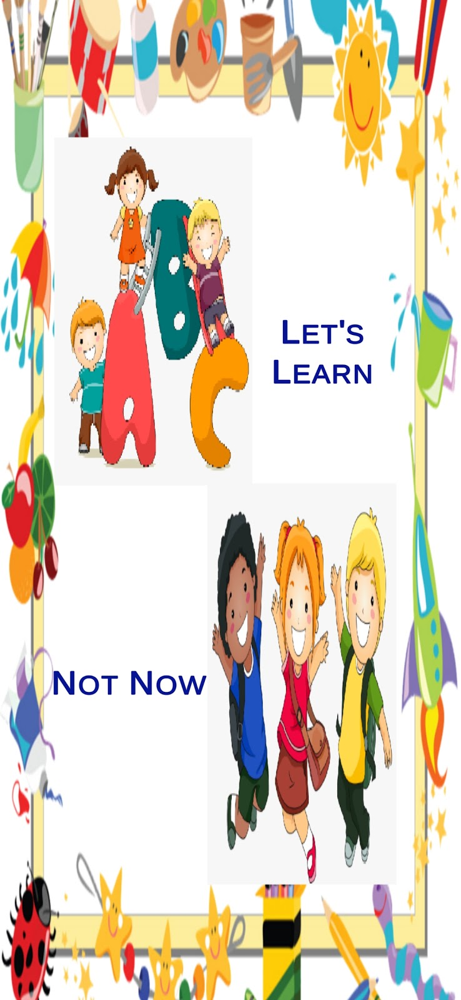
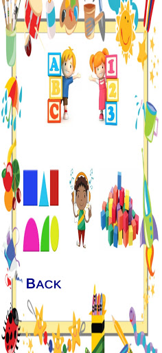
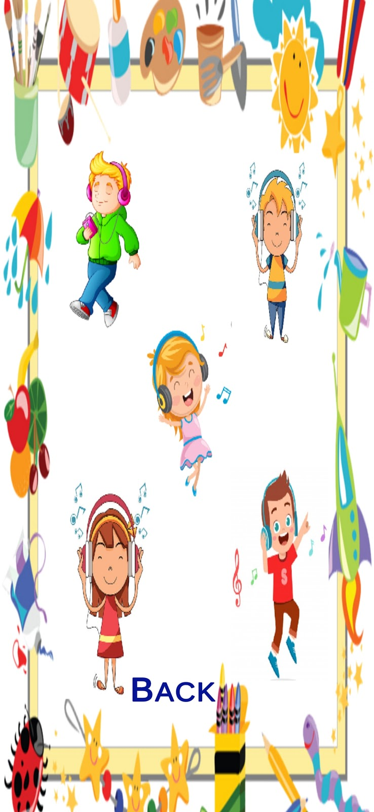
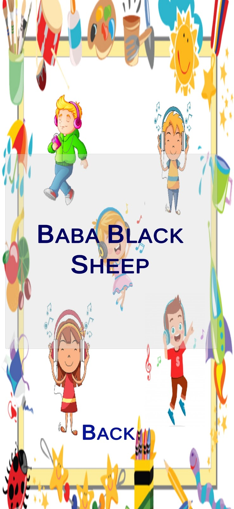
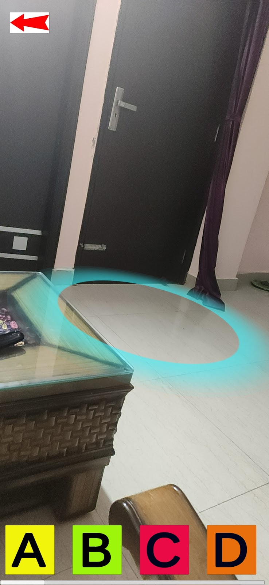
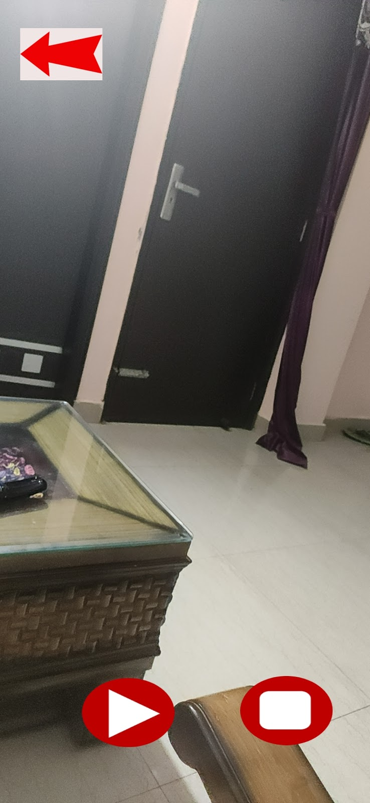

# Eduthon-AR : FunLearn
<h2>An AR app to make your kid fall in love with learning!</h2>

We have often seen how difficult it is to get our super naughty kids to start studying. This is however about to change.

FunLearn incorporates Augmented Reality to help children take their first step into formal education. With a wide variety of options to choose from like learning alphabets or numbers to fun rhymes, colors and shapes, it has got enough elements to keep the child engaged.

We have kept the UI attractive to catch the child's attention yet simple to use. 
Demo Video: <a>https://drive.google.com/folderview?id=1zGgXT6HzgcESBC-soxztMvYUlzcYCNwJ </a> 
Apk:  

Let’s start with the functioning of the app:

<h3>The Start Menu:</h3>

This is a simple menu which gives the user either the option to go ahead or to quit the application.

<h3>The Choices Menu:</h3>

This is the frame where the user sees various options of learning to choose from. We have chosen pictures instead of simple bland text as neither kids of this age group understand it nor would it grab their attention.

<h3>The Rhymes Scene</h3>

This scene has several options to choose from. We had to figure out a way of displaying the rhyme name and also to not make the child feel bombarded with so much textual information. We used the hidden panel for resolving this issue. On clicking any of the children listening to the music a hidden panel opens up, showing the name of the rhyme.

.                  

<h3>The Placement Indicator:</h3>

The placement Indicator is a blue circular shaped ring. On loading a particular AR Scene, the user must allow upto 10-20 seconds for the AR Camera to absorb the surrounding and place the indicator in the centre of the screen. On clicking the buttons the AR Object gets instantiated and we also hear audio describing what was the learning from that object.
On clicking another button the previous objects get deleted and we see a new object.

We chose to allow only one object to be instantiated because considering our target audience it was essential to build a more user friendly app.

<h3>The Back Button:</h3>

The back buttons are used to move to the previous scene and give the user the flexibility to have multiple choices.

